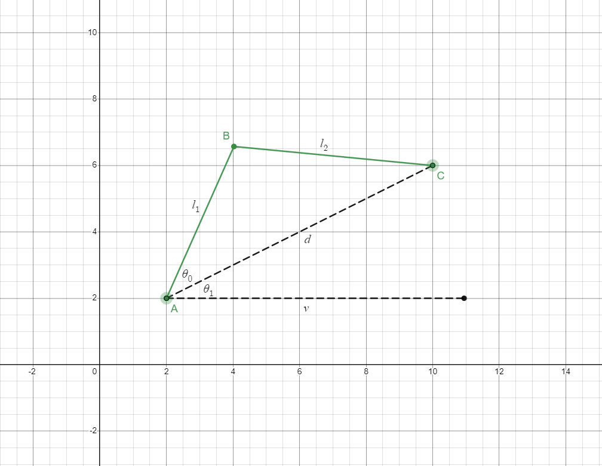

# Procedural Animation

This is a 3D Unity project made to experiment, develop and demo procedural animation using inverse kinematics. The IK (inverse kinematic) calculations only work for one joint at the moment, although with some tinkering it should be able to recursively solve more complicated IKs.

The demonstration is done using a spider-like character made through Unity, although the IKs themselves should work for any type of one-joint limbs, such as a humanoid arm or leg.

## Inverse Kinematics

### 2D

Let point $A$ be the `body` of the limb, point $B$ be the joint between our two limbs, point $C$ be the target our limb is trying to reach. Then we simply need to find $B$ and position each of the bones in the limb such that the first bone is going from $A$ to $B$ and the second bone is going from $B$ to $C$.

Each IK is solved using this formula derived from the law of cosines:

$$\theta_0 = { \arccos\left( { l_1^2+d^2-l_2^2\over2 l_1 d } \right) }$$

Where $l_1$ is the length of the first bone, $l_2$ is the length of second bone, and $d$ is the distance from the object to the target. This formula gives us $\theta_0$, which represents the angle from $\vec{x}$ to $\overrightarrow{AB}$ where $\vec{x}$ is the vector with magnitute $d$ going along the x-axis from $A$. Next we need to find the angle between the vectors $\overrightarrow{AC}$ and $\vec{x}$. We can calculate this as 

$$\theta_1 = { \arccos\left(\overrightarrow{AC} \cdot \vec{x} \over |\overrightarrow{AC}|\left|\vec{x}\right|\right) c }$$

Where $c = {\{ A_y < C_y : 1, A_y > C_y : -1 \}}$.

We can then calculate the angle between $\overrightarrow{AC}$ and $\overrightarrow{AB}$ as $\theta = \theta_0 + \theta_1$.

This angle allows us to derive the global position of $B$ by converting from polar to cartesian coordinates and adding the new point to $A$:
$$B = A + {\left(cos(\theta) * l_1, sin(\theta) * l_1\right)}$$

Once we have calculated $B$, we can finally position our limbs in a way such that they reach the target while connected without overlapping.

